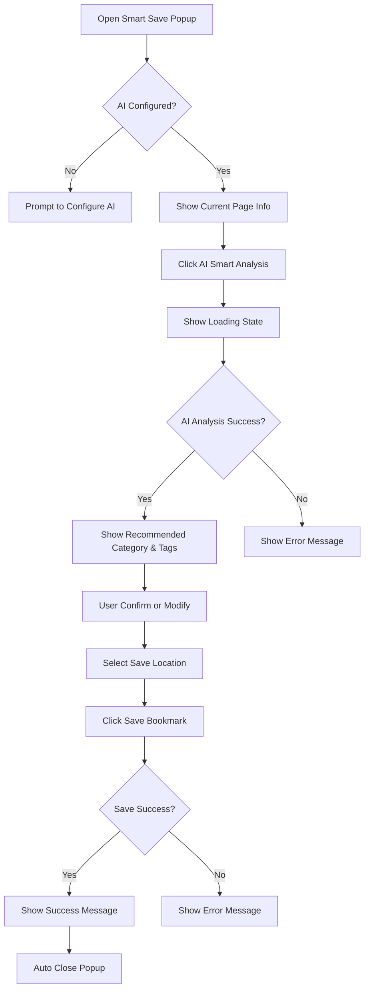
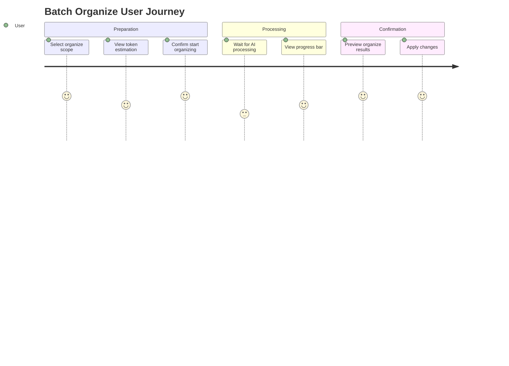
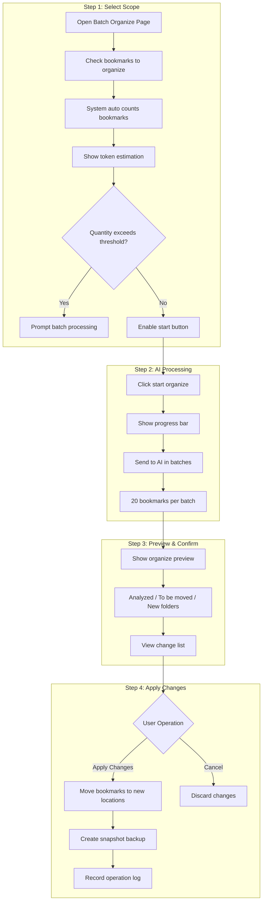
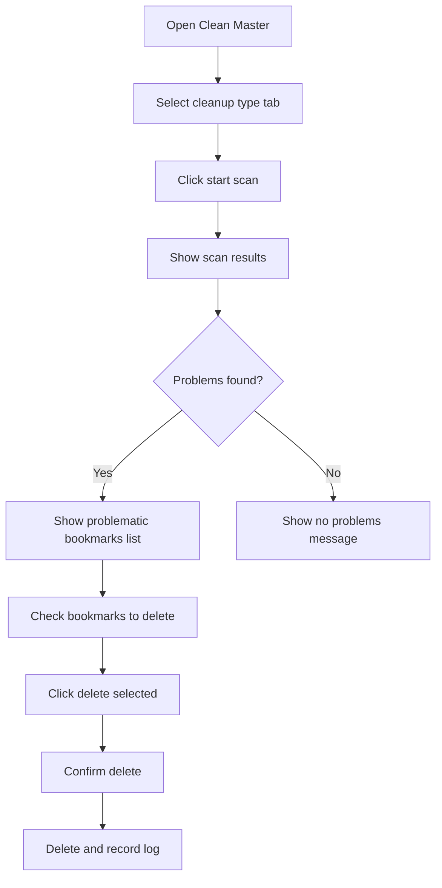
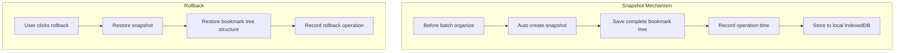

# AI Smart Bookmark Organizer - User Manual

> Version: v1.0.0 | Keep Your Bookmark Collection Organized

---

## Table of Contents

1. [Product Introduction](#1-product-introduction)
2. [Quick Start](#2-quick-start)
3. [Feature Details](#3-feature-details)
4. [FAQ](#4-faq)

---

## 1. Product Introduction

### 1.1 What is AI Smart Bookmark Organizer?

AI Smart Bookmark Organizer (ASBO) is an intelligent bookmark management tool that uses AI semantic understanding technology to help you:

- **Smart Save**: Analyze the current page with one click, automatically recommend categories and tags
- **Batch Organize**: Organize large numbers of bookmarks with one click, avoid messy collections
- **Clean Master**: Automatically detect broken links, duplicate bookmarks
- **History Rollback**: Undo organizing operations anytime, worry-free
- **Tag Visualization**: View tag distribution intuitively in a bubble chart

### 1.2 Core Advantages

| Advantage | Description |
|-----------|-------------|
| **Privacy First** | API Key stored locally only, bookmark data not uploaded to servers, supports local Ollama |
| **Cost Controllable** | Local Ollama (completely free), cloud API pay-per-use, token consumption estimation |
| **Smart & Efficient** | AI automatically analyzes page content, batch organization saves time, smart tag recommendations |
| **Safe Operations** | Automatic backup before organizing, one-click rollback anytime, operation log recording |
| **Multi-language Support** | Chinese interface, English Interface, AI output language preference settings |

### 1.3 Use Cases

| Use Case | Description |
|----------|-------------|
| Developers | Organize technical docs, GitHub repos, API docs |
| Researchers | Manage papers, reference materials, data sources |
| Heavy Users | Have hundreds or thousands of bookmarks, disorganized |
| Knowledge Workers | Build personal knowledge bases, need organized management |
| Multi-language Users | Need both Chinese and English bilingual interface support |

---

## 2. Quick Start

### 2.1 Install the Extension

**Steps:**

1. Open Chrome browser
2. Visit Chrome Web Store
3. Search for "AI Smart Bookmark Organizer"
4. Click "Add to Chrome"
5. Confirm permission requests (bookmarks, storage, current tab)

### 2.2 Configure AI Service

First-time use requires AI service configuration, supporting two methods:

#### Method 1: Cloud API (Recommended for Beginners)

1. Click extension icon → Right-click "Options"
2. Select "Cloud API"
3. Click "Quick Select Model" button to select provider
4. Click "Test Connection" to verify
5. Click "Save Settings"

#### Method 2: Local Ollama (Recommended for Privacy-sensitive Users)

1. **Install Ollama**
   - Visit [https://ollama.com](https://ollama.com) to download and install

2. **Download Model**
   ```bash
   # Download gemma3:270m model (lightest test, recommend selecting larger parameter models based on your PC performance)
   ollama pull gemma3:270m
   ```

3. **Start Ollama Service**
   ```bash
   # Set environment variables to allow extension access, if unsuccessful see Q&A below (important!)

   # Windows PowerShell
   $env:OLLAMA_HOST="0.0.0.0"
   $env:OLLAMA_ORIGINS="*"
   ollama serve

   # Windows CMD
   set OLLAMA_HOST=0.0.0.0
   set OLLAMA_ORIGINS=*
   ollama serve

   # Mac/Linux
   OLLAMA_HOST=0.0.0.0 OLLAMA_ORIGINS=* ollama serve
   ```

4. **Configure in Extension**
   - Open extension settings page
   - Select "Local Ollama"
   - Enter Ollama address (default: `http://localhost:11434`)
   - Enter model name (view installed models by running `ollama list` in cmd)
   - Click "Test Connection" to verify
   - Click "Save Settings"

5. **Remote Ollama Configuration** (Optional)
   - If running Ollama on another device, enter corresponding IP address
   - Example: `http://192.168.1.100:11434`
   - Ensure remote Ollama has `OLLAMA_HOST=0.0.0.0` set

### 2.3 Switch Language

Extension supports bilingual interface in Chinese and English:

1. Open extension settings page
2. Find language switch button in top right corner
3. Click "中文" or "English" to switch interface language

**Note:** The page will automatically refresh after switching language.

### 2.4 Your First Smart Save

**Operation Steps:**

1. Browse to the webpage you want to bookmark
2. Click ASBO icon in toolbar, or press shortcut key `Crtl+Shift+S` to open panel
3. Click AI analysis and wait approximately 1-3 seconds
4. View recommended categories and tags
5. To modify, click dropdown to select another folder
6. Click "Save Bookmark" to complete

**Quick Save Mode:**
- Press `Alt+Shift+S` for one-click analysis and save
- Or click "Quick" switch in top right corner after `Crtl+Shift+S` opens the panel

---

## 3. Feature Details

### 3.1 Smart Save

Replaces browser's native `Ctrl+D`, providing a smarter bookmarking experience.

#### Feature Access

| Method | Operation | Description |
|--------|-----------|-------------|
| Toolbar Icon | Click extension icon | Open full edit mode |
| Shortcut | `Alt+Shift+S` | Open quick save mode |
| Shortcut | `Ctrl+Shift+S` | Open full edit mode |

#### Interface Description

```
┌─────────────────────────────────────┐
│  📑 Smart Save            [Quick] ⚙️│
├─────────────────────────────────────┤
│                                     │
│  Title                              │
│  ┌─────────────────────────────┐   │
│  │ Kimi - K2 Long Thinking     │   │
│  └─────────────────────────────┘   │
│                                     │
│  URL                                │
│  ┌─────────────────────────────┐   │
│  │ https://www.kimi.com/       │   │
│  └─────────────────────────────┘   │
│                                     │
│  [✨ AI Smart Analysis]             │
│                                     │
│  ┌─────────────────────────────┐   │
│  │ ✨ AI Suggestion            │   │
│  │ Category: AI Tools (92%)    │   │
│  │ Reason: AI Chat Tool        │   │
│  │ [Create Folder "AI Tools"]  │   │
│  └─────────────────────────────┘   │
│                                    │
│  Save to                           │
│  ┌─────────────────────────────┐   │
│  │ ▼ AI Tools                  │   │
│  └─────────────────────────────┘   │
│                                    │
│  Tags                              │
│  ┌─────────────────────────────┐   │
│  │ Add tags...           [Add] │   │
│  └─────────────────────────────┘   │
│  [LLM] [Domestic] [Chat] [×]       │
│                                    │
│  ┌──────────┐  ┌──────────────┐    │
│  │ Cancel   │  │ Save         │    │
│  └──────────┘  └──────────────┘    │
│                                    │
└────────────────────────────────────┘
```

#### Operation Flow



#### Tag Management

| Operation | Description |
|-----------|-------------|
| Add Tag | Enter tag name, press Enter or click "Add" |
| Delete Tag | Click × on right side of tag |
| AI Recommend Tags | Click "AI Smart Analysis" to auto-generate |

---

### 3.2 Batch Organize

Organize large numbers of bookmarks with one click,告别 bookmark chaos.

#### Feature Access

1. Click extension icon → Right-click "Options"
2. Switch to "Batch Organize" tab

#### User Journey



#### Operation Flow



---

### 3.3 Clean Master

Automatically detect problematic bookmarks, keep your collection healthy.

#### Feature Access

Settings page → "Clean Master" tab

#### Cleanup Types

| Cleanup Type| Description | Operations |
|--------------|-------------|------------|
| Broken Links | Detect links returning 404/500 or inaccessible | View, Delete |
| Duplicate Bookmarks | Match duplicates based on URL | Merge, Delete |

#### Operation Flow



---

### 3.4 History & Rollback

Undo organizing operations anytime, worry-free.

#### Feature Access

Settings page → "History" tab

#### Snapshot Mechanism



#### Operation Log

| Field | Description |
|-------|-------------|
| Time | Operation execution time |
| Type | Batch Organize / Clean Master / Rollback |
| Affected Count | Number of bookmarks affected |
| Description | Operation details |
| Snapshot | Associated snapshot ID |

---

### 3.5 Bookmark Statistics & Tag Visualization

#### Feature Access

Settings page → "Bookmark Statistics" tab

#### Statistics

| Statistic | Description |
|-----------|-------------|
| Total Bookmarks | Count of all bookmarks |
| Folder Count | Number of user-created folders |
| Max Depth | Folder hierarchy depth |
| Token Estimation | Token consumption for batch processing |

#### Tag Visualization

Display tag distribution in bubble chart format:
- Bubble size indicates number of bookmarks under that tag
- Bubble color differentiates different tags
- Click bubble to view all bookmarks under that tag

---

### 3.6 Settings

#### AI Settings

| Setting | Description |
|---------|-------------|
| AI Type | Cloud API / Local Ollama |
| Quick Select Model | Kimi / DeepSeek / GLM / MiniMax / Gemini / GPT |
| Base URL | API base address |
| API Key | Your API key (required for cloud API) |
| Model Name | Model name |
| Ollama Service Address | Local Ollama address |
| Ollama Model Name | Installed model name |

#### AI Output Language Preference

| Option | Description |
|--------|-------------|
| Chinese | Categories and tags returned by AI in Chinese |
| English | Categories and tags returned by AI in English |

#### Organize Settings

| Setting | Description | Default Value |
|---------|-------------|---------------|
| Max Organize Quantity | Exceeding this will prompt batch processing | 50 |
| Token Warning Threshold | Show warning when exceeding this value | 10000 |

---

## 4. FAQ

### Q1: Ollama connection failed, what to do?

**A:** Need to set environment variables before starting Ollama:

```powershell
# Windows PowerShell
$env:OLLAMA_HOST="0.0.0.0"
$env:OLLAMA_ORIGINS="*"
ollama serve

# Windows CMD
set OLLAMA_HOST=0.0.0.0
set OLLAMA_ORIGINS=*
ollama serve

# Mac/Linux
OLLAMA_HOST=0.0.0.0 OLLAMA_ORIGINS=* ollama serve
```

Notes:
1. If variable settings fail, manually open environment variables interface and add 2 system environment variables
2. Disable "Allow External Access" in Ollama Settings
3. Execute `ollama serve` command separately in command line
4. Confirm Ollama is correctly started and selected model exists (view installed models via `ollama list`)
5. Confirm Ollama address in extension configuration is correct, view ipv4 via `ipconfig` command, replace with http://10.xxx.x.xx:11434

### Q2: What are the smart save shortcuts?

**A:**
- `Alt+Shift+S` - Open quick save mode
- `Ctrl+Shift+S` - Open full edit mode

Can be modified in Chrome extension shortcut settings.

### Q3: Will batch organize delete my bookmarks?

**A:** No. Batch organize only moves bookmarks to recommended folders, creates snapshot automatically before organizing, can be rolled back anytime.

### Q4: Is my API Key secure?

**A:** Your API Key is only stored in local browser encrypted storage, not uploaded to any server.

### Q5: Which AI models are supported?

**A:**
- **Cloud**: Kimi, DeepSeek, GLM, MiniMax, Gemini, GPT
- **Local**: Any model supported by Ollama

### Q6: Can I restore bookmarks after organizing?

**A:** Yes. Snapshot is automatically created before each batch organize, you can click "Rollback" in "History" to restore.

### Q7: Why weren't some bookmarks organized?

**A:** Possible reasons:
- Bookmark title too simple (e.g., "Home"), AI cannot judge
- Exceeded "Max Organize Quantity" setting
- Bookmark is already in appropriate folder

### Q8: How to switch interface language?

**A:**
1. Open extension settings page
2. Find language switch button in top right corner
3. Click "中文" or "English"
4. Page will automatically refresh and show corresponding language

### Q9: How are tags generated?

**A:** Tags are automatically generated by AI based on page content. When using smart save feature, AI analyzes page title, description, and URL to recommend relevant tags. Tag data is stored in local IndexedDB.

### Q10: How accurate is Clean Master's broken link detection?

**A:** Due to some websites having anti-crawler mechanisms, broken link detection may not be completely accurate. Recommendations:
- For important bookmarks, manually verify before deleting
- Detection results are for reference only

---

## Appendix

### Keyboard Shortcuts

| Shortcut | Function |
|----------|----------|
| `Alt+Shift+S` | Quick save mode |
| `Ctrl+Shift+S` | Full edit mode |

### Glossary

| Term | Description |
|------|-------------|
| Token | Basic unit for AI model text processing |
| Snapshot | Complete backup of bookmark tree |
| System Folder | Default "Bookmarks Bar", "Other Bookmarks", etc. |
| Ollama | Tool for running large language models locally |
| IndexedDB | Browser local database |

---

*Document End*
