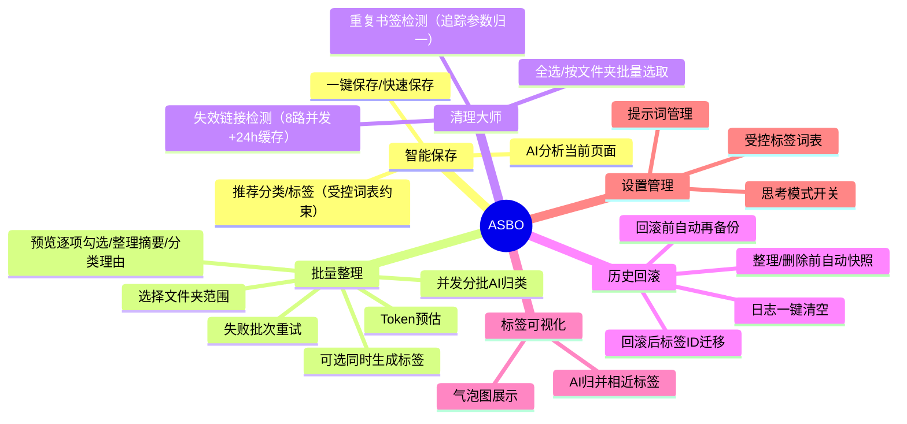
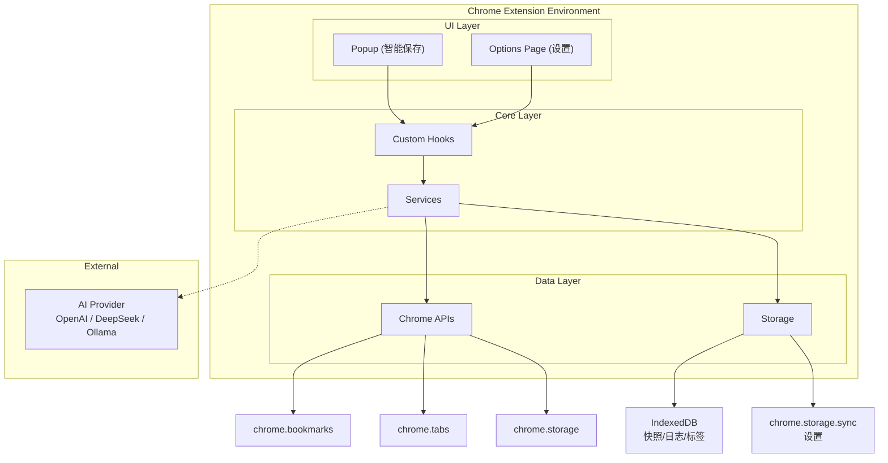
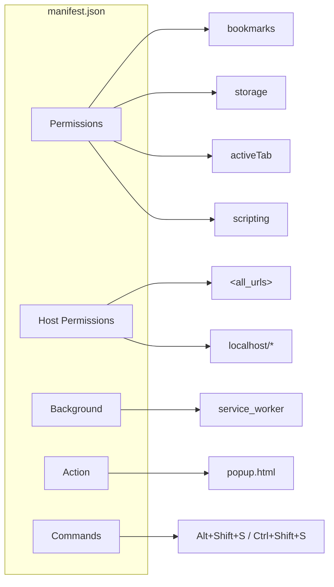
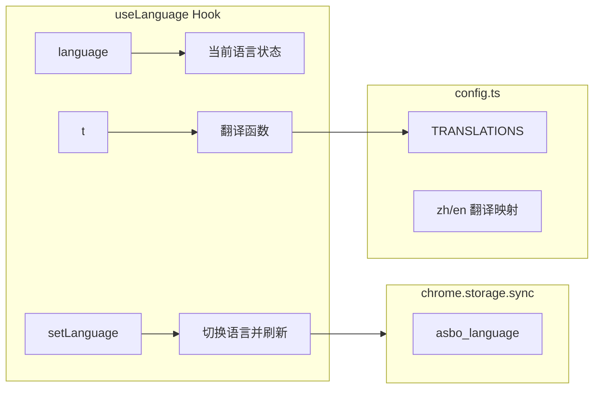
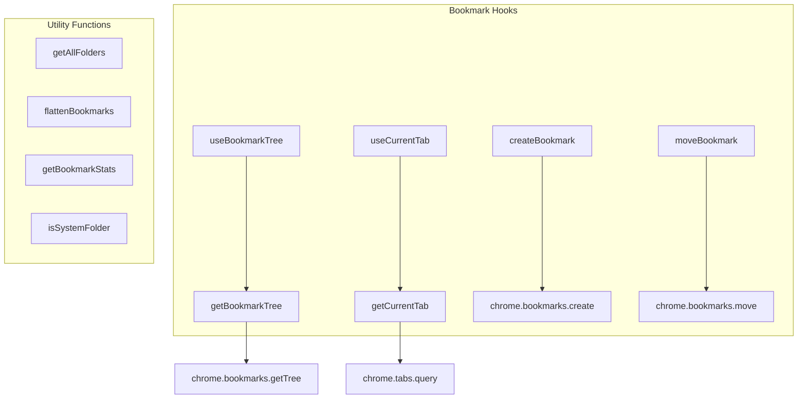
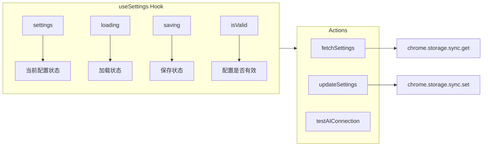
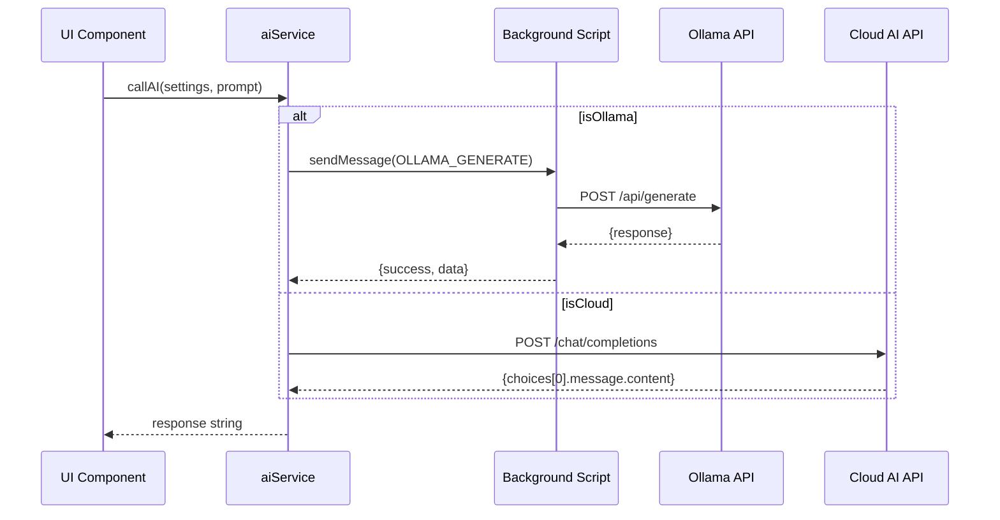
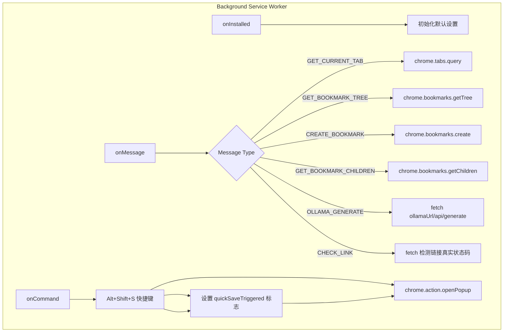
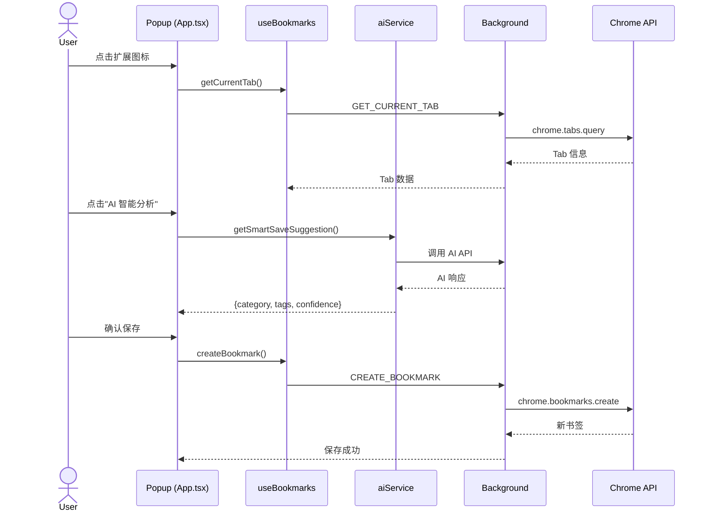
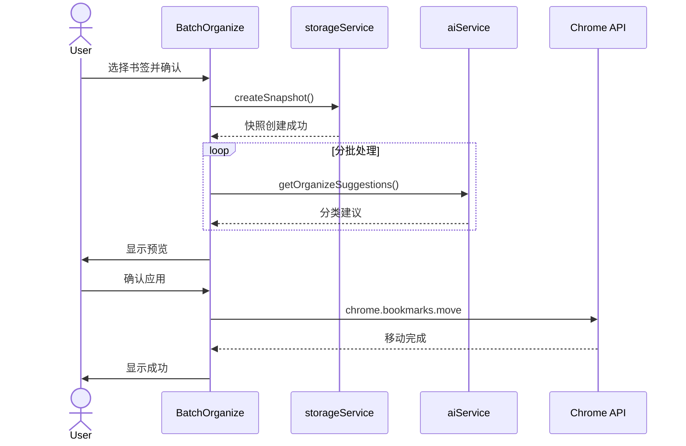

# AI Smart Bookmark Organizer - 开发说明文档

> 版本：v2.0.0 | 最后更新：2026-07-18

---

## 目录

1. [项目概述](#1-项目概述)
2. [技术架构](#2-技术架构)
3. [项目结构](#3-项目结构)
4. [核心模块详解](#4-核心模块详解)
5. [数据流与交互](#5-数据流与交互)
6. [当前进度](#6-当前进度)
7. [开发计划](#7-开发计划)
8. [未来产品功能优化拓展路径](#8-未来产品功能优化拓展路径)

---

## 1. 项目概述

### 1.1 产品定位

AI Smart Bookmark Organizer (ASBO) 是一款 Chrome 浏览器扩展，通过 AI 语义理解帮助用户自动整理浏览器收藏夹，解决"只收藏不整理"和"收藏后找不到"的痛点。

### 1.2 核心价值

- **隐私优先**：API Key 仅存储在本地，书签数据不上传
- **成本可控**：支持本地 Ollama 模型，无需付费
- **智能整理**：AI 自动分析页面内容，推荐分类和标签

### 1.3 功能模块



---

## 2. 技术架构

### 2.1 技术栈

| 层级 | 技术 | 说明 |
|------|------|------|
| 核心框架 | React 19 + TypeScript | UI 组件开发 |
| 构建工具 | Vite + CRXJS | Chrome 扩展打包 |
| UI 组件 | shadcn/ui + TailwindCSS | 美观且轻量 |
| 状态管理 | React Context + Hooks | MVP 阶段足够 |
| 存储 | chrome.storage + IndexedDB | 设置与快照 |
| API 通信 | Native fetch | 流式响应支持 |
| 国际化 | 自定义 i18n Hook | 中英双语支持 |
| 虚拟滚动 | @tanstack/react-virtual | 大列表渲染性能 |
| 测试 | Vitest | 纯函数单元测试（35 例） |

### 2.2 架构模式



### 2.3 Manifest V3 配置



---

## 3. 项目结构

```
app/
├── manifest.json              # 扩展配置文件
├── index.html                 # Popup 入口
├── options.html               # 设置页面入口
├── vite.config.ts             # Vite + CRXJS 配置
├── src/
│   ├── App.tsx               # Popup 主组件（智能保存）
│   ├── OptionsPage.tsx       # 设置页面组件
│   ├── options.tsx           # 设置页面入口
│   ├── background.ts         # Service Worker
│   ├── main.tsx              # Popup 入口
│   ├── index.css             # 全局样式
│   ├── config.ts             # 配置文件（模型预设、翻译）
│   ├── types/
│   │   └── index.ts          # TypeScript 类型定义
│   ├── hooks/
│   │   ├── useBookmarks.ts   # 书签操作 Hook
│   │   ├── useSettings.ts    # 设置管理 Hook
│   │   └── useLanguage.ts    # 语言切换 Hook (i18n)
│   ├── services/
│   │   ├── aiService.ts      # AI API 调用服务
│   │   └── storageService.ts # IndexedDB 存储服务
│   ├── lib/
│   │   ├── url.ts            # URL 归一化工具（重复检测）
│   │   └── linkCache.ts      # 失效检测结果缓存（24h TTL）
│   ├── __tests__/
│   │   └── utils.test.ts     # Vitest 单元测试
│   ├── components/
│   │   ├── BatchOrganize.tsx # 批量整理组件
│   │   ├── HistoryPage.tsx   # 历史记录组件
│   │   ├── CleanMaster.tsx   # 清理大师组件
│   │   ├── TagVisualization.tsx # 标签可视化组件
│   │   └── BookmarkTreeSelect.tsx # 书签树多选组件
│   └── components/ui/        # shadcn/ui 组件
├── public/
│   └── icons/                # 扩展图标
└── dist/                     # 构建输出
```

---

## 4. 核心模块详解

### 4.1 类型定义 (types/index.ts)

```typescript
// 核心类型
interface BookmarkNode {
  id: string;
  parentId?: string;
  title: string;
  url?: string;
  children?: BookmarkNode[];
  dateAdded?: number;
}

interface AISettings {
  aiType: 'cloud' | 'ollama'; // 显式 AI 类型（旧数据按 baseUrl 迁移推断）
  baseUrl: string;
  apiKey: string;             // 存储于 chrome.storage.local
  modelName: string;
  ollamaUrl: string;
  ollamaThink?: boolean;      // Ollama 思考模式开关（默认关闭）
  maxOrganizeCount: number;
  tokenWarningThreshold: number;
  languagePreference: 'zh' | 'en';
  customPrompts?: CustomPrompts;         // 自定义提示词模板（storage.local）
  customControlledTags?: { zh?: string[]; en?: string[] }; // 自定义受控词表
}

interface BookmarkSnapshot {
  id: string;
  timestamp: number;
  bookmarkCount: number;
  treeData: BookmarkNode[];
  description: string;
}

interface Tag {
  id: string;
  name: string;
  bookmarkIds: string[];
  createdAt: number;
}
```

### 4.2 国际化实现 (hooks/useLanguage.ts)



**核心特性：**
- 支持中英文双语切换
- 翻译内容集中管理在 `config.ts`
- 语言设置持久化到 `chrome.storage.sync`
- 切换语言后自动刷新页面

### 4.3 书签操作 Hook (hooks/useBookmarks.ts)



**核心函数说明：**

| 函数 | 作用 | 返回值 |
|------|------|--------|
| `getBookmarkTree()` | 获取完整书签树 | `Promise<BookmarkNode[]>` |
| `getAllFolders()` | 获取所有用户文件夹（排除系统文件夹） | `BookmarkNode[]` |
| `flattenBookmarks()` | 扁平化书签树 | `BookmarkNode[]` |
| `getBookmarkStats()` | 统计书签信息 | `{bookmarkCount, folderCount, maxDepth}` |
| `isSystemFolder()` | 判断是否为系统文件夹 | `boolean` |

### 4.4 设置管理 Hook (hooks/useSettings.ts)



**AI 类型判断逻辑：**
```typescript
// 通过显式 aiType 字段判断（旧数据按 baseUrl 自动迁移推断）
const isOllama = settings.aiType === 'ollama';

// Ollama 模式只需 ollamaUrl 和 modelName
// 云端 API 模式需要 apiKey、baseUrl 和 modelName
```

**存储策略：**
- 常规设置：chrome.storage.sync
- API Key、自定义提示词、自定义受控词表：chrome.storage.local（不上传同步服务器）
- 设置页提供「提示词管理」，可查看/自定义智能保存、批量整理、整理摘要等提示词模板（{{变量}} 占位符运行时替换）
- 设置页提供「受控标签词表」，空格分隔编辑，可一键恢复默认词表
- Ollama 配置区提供「思考模式」开关（默认关闭）：关闭时请求携带 think:false 保证 JSON 输出纯净；仅对 MiniCPM5、DeepSeek-R1 等思考型模型有意义

### 4.5 AI 服务 (services/aiService.ts)



**核心函数说明：**

| 函数 | 作用 | 参数 |
|------|------|------|
| `callAI()` | 通用 AI 调用接口 | `settings, prompt, onStream?` |
| `getSmartSaveSuggestion()` | 获取智能保存建议 | `settings, title, url, description, folders` |
| `getOrganizeSuggestions()` | 批量整理建议（云端 3 路并发） | `settings, bookmarks, folders, onProgress?` |
| `getOrganizeSummary()` | 整理思路摘要 | `settings, total, categoryStats` |
| `getTagMergeSuggestions()` | AI 归并相近标签 | `settings, tagNames` |
| `estimateOrganizeTokens()` | 预估 Token 消耗（中文按 1.5 字符/token） | `bookmarks, folders, settings?` |
| `estimateTokens()` | 通用 Token 估算 | `text` |
| `extractJson()` | AI 响应 JSON 提取（剥思维链/暗喧文本） | `text` |
| `testAIConnection()` | 测试 AI 连接（请求/解析两阶段报错） | `settings` |

**关键机制：**
- 批量整理云端 API 3 路并发（本地 Ollama 保持串行防止超载），429/5xx/网络错误指数退避重试（1s→2s→4s）
- Ollama 请求携带 `think` 字段（默认 false），避免思考型模型输出思维链撑破 JSON 解析
- 所有 AI 响应经 `extractJson()` 统一提取 JSON：剥离 `</think>` 前思维链，括号配对提取首个完整 JSON 片段
- 打标 prompt 注入受控标签词表（`{{controlledTags}}` 占位符），约束 AI 优先复用词表

### 4.6 Background Script (background.ts)



**Ollama CORS 绕过方案：**
- 由于 Chrome 扩展的 CORS 限制，Ollama 请求通过 Background Script 代理
- Background Script 不受网页 CORS 限制，可直接访问 localhost
- 支持自定义 Ollama 地址（包括远程 Ollama 服务）

**失效链接检测代理（CHECK_LINK）：**
- Options 页直接 fetch 目标网站受 CORS 限制，无法拿到真实状态码
- Background 代理发起 HEAD 请求（GET 兼容），返回真实 HTTP 状态
- 前端 8 路并发池调度，24 小时结果缓存（chrome.storage.local），支持取消

**书签事件监听：**
- `onRemoved`：同步清理标签表中的书签引用（含文件夹子树），空标签自动删除
- 全部变更事件：使 popup 的 `chrome.storage.session` 书签树缓存失效

---

## 5. 数据流与交互

### 5.1 智能保存流程



### 5.2 批量整理流程



---

## 6. 当前进度

### 6.1 已完成功能（V2.0）

| 模块 | 功能 | 状态 |
|------|------|------|
| 项目架构 | React 19 + TS + Vite + CRXJS 搭建 | ✅ |
| Manifest V3 | 完整配置（权限、快捷键、图标） | ✅ |
| 国际化 | 中英文双语（界面与历史数据文案全覆盖） | ✅ |
| 设置页面 | AI 配置、提示词管理、受控词表、整理设置、书签统计、关于 | ✅ |
| Popup 弹窗 | 智能保存界面（标题、文件夹、标签） | ✅ |
| 书签读取 | Chrome Bookmarks API 封装 + O(1) 索引 + 变更自动刷新 | ✅ |
| 系统文件夹过滤 | 正确识别并排除系统文件夹 | ✅ |
| AI 服务 | Token 预估、Prompt 构建、并发调用、退避重试、JSON 提取兜底 | ✅ |
| Ollama 支持 | Background 代理绕过 CORS、思考模式开关 | ✅ |
| 存储服务 | IndexedDB 快照、日志、标签；数据变更事件通知 | ✅ |
| 批量整理 | 书签树选择（虚拟滚动）、并发分批、预览逐项勾选/摘要/理由、失败重试、同步打标 | ✅ |
| 清理大师 | 失效检测（8 路并发+进度+取消+24h 缓存）、重复检测（追踪参数归一）、批量选取、删除前快照 | ✅ |
| 历史回滚 | 操作日志（一键清空）、快照管理、回滚前自动备份、标签 ID 迁移 | ✅ |
| 标签可视化 | 气泡图展示、标签详情弹窗、AI 归并相近标签 | ✅ |
| 性能优化 | 树查找 O(1) 索引、虚拟滚动、popup 树缓存 | ✅ |
| 单元测试 | Vitest 35 例（URL 归一、Token 预估、JSON 提取、标签规范化等） | ✅ |

---

## 7. 开发计划

### 7.1 已完成的里程碑

- **V1.0：基础架构 + 智能保存 + 批量整理 + 清理大师 + 历史回滚 + 标签可视化** ✅
- **V2.0：稳定性与体验强化** ✅
  - P0 数据安全与正确性：清理删除前快照、URL 归一化、Token 预估修正、API Key 本地存储、预览完整显示/摘要/不中断
  - P1 核心功能修复：失效检测真实状态码（并发+进度+取消）、回滚加固、标签引用清理、应用更改容错、i18n 全覆盖
  - P2 性能与工程化：O(1) 索引、AI 并发调用、虚拟滚动、Vitest 单测、依赖瘦身、sonner 反馈
  - 增量：失效扫描 24h 缓存、标签治理（受控词表 + AI 归并）、思考模式开关、批量整理同步打标

### 7.2 V3.0 规划

第 8 节中尚未实现的优化与拓展均归入 V3.0 及以后版本规划。

---

## 8. 未来产品功能优化拓展路径（V3.0+）

### 8.1 近期优化（v3.0 - v3.1）

#### 8.1.1 智能保存增强
- **智能推荐优化**
  - 基于用户历史保存行为学习偏好
  - 根据时间/域名自动推荐常用文件夹
  - 相似页面智能去重提示
  
- **标签系统增强**
  - 标签自动补全（基于已有标签）
  - 标签云热度排序
  - 标签关联推荐（经常一起使用的标签）

- **UI/UX 改进**
  - 添加骨架屏加载效果
  - 流式响应显示 AI 思考过程
  - 深色模式支持

#### 8.1.2 批量整理优化
- **分批策略优化**
  - 智能分批（按主题相似度分组）
  - 支持取消/暂停长时间任务
  - 断点续传功能

- **预览功能增强**
  - 左右对照视图（原位置 vs 新位置）
  - 批量接受/拒绝操作
  - 冲突检测与解决

### 8.2 中期功能（v3.2 - v3.5）

#### 8.2.1 搜索与发现
- **全文搜索**
  - 书签标题、URL、标签全文检索
  - 模糊搜索支持
  - 搜索结果高亮

- **智能推荐**
  - "稍后阅读"列表管理
  - 过期书签提醒（超过X天未访问）
  - 热门分类推荐

#### 8.2.2 数据同步与备份
- **云端同步**
  - 跨设备书签同步
  - 端到端加密保护隐私
  - 可选的云端备份服务

- **导入/导出**
  - 支持多种格式（HTML/JSON/CSV）
  - 批量导入去重
  - 定期自动备份

#### 8.2.3 浏览器支持扩展
- **多浏览器支持**
  - Firefox 版本
  - Edge 版本
  - Safari 扩展

### 8.3 长期愿景（v4.0+）

#### 8.3.1 AI 能力升级
- **本地 AI 模型**
  - 集成轻量级本地 embedding 模型
  - 语义相似度搜索
  - 无需联网的智能分类

- **知识图谱**
  - 书签主题关联图谱
  - 自动发现知识关联
  - 学习路径推荐

#### 8.3.2 协作与分享
- **团队协作**
  - 共享书签文件夹
  - 团队知识库建设
  - 权限管理

- **社交功能**
  - 书签收藏集分享
  - 发现优质内容
  - 社区推荐

#### 8.3.3 高级分析
- **使用分析仪表盘**
  - 收藏习惯统计
  - 阅读完成率追踪
  - 时间分布分析

- **智能报告**
  - 每周/每月书签报告
  - 热门领域分析
  - 阅读建议

### 8.4 技术债务与优化

#### 8.4.1 性能优化
- [x] 虚拟滚动处理大量书签（V2 已完成）
- [ ] IndexedDB 查询优化
- [ ] 组件懒加载
- [ ] 图片/图标缓存

#### 8.4.2 测试覆盖
- [x] 单元测试（Vitest，35 例）（V2 已完成）
- [ ] E2E 测试（Playwright）
- [ ] 视觉回归测试
- [ ] 性能基准测试

#### 8.4.3 开发者体验
- [ ] Storybook 组件文档
- [ ] API 文档自动生成
- [ ] 开发环境热更新优化
- [ ] CI/CD 流水线完善

---

## 附录

### A. 环境变量设置（Ollama）

```bash
# Windows PowerShell
$env:OLLAMA_HOST="0.0.0.0"
$env:OLLAMA_ORIGINS="*"
ollama serve

# Windows CMD
set OLLAMA_HOST=0.0.0.0
set OLLAMA_ORIGINS=*
ollama serve

# Mac/Linux
OLLAMA_HOST=0.0.0.0 OLLAMA_ORIGINS=* ollama serve
```

### B. 常用命令

```bash
# 开发模式
cd app && npm run dev

# 生产构建
cd app && npm run build

# 运行单元测试
cd app && npm run test

# 加载扩展
# 1. 打开 chrome://extensions/
# 2. 开启开发者模式
# 3. 点击"加载已解压的扩展程序"
# 4. 选择 dist/ 文件夹
```

### C. 目录结构速查

```
src/
├── App.tsx              # Popup 主组件
├── OptionsPage.tsx      # 设置页面
├── background.ts        # Service Worker
├── config.ts            # 配置文件
├── types/index.ts       # 类型定义
├── hooks/
│   ├── useBookmarks.ts  # 书签操作
│   ├── useSettings.ts   # 设置管理
│   └── useLanguage.ts   # 国际化
├── services/
│   ├── aiService.ts     # AI API
│   └── storageService.ts # IndexedDB
└── components/
    ├── BatchOrganize.tsx    # 批量整理
    ├── HistoryPage.tsx      # 历史记录
    ├── CleanMaster.tsx      # 清理大师
    ├── TagVisualization.tsx # 标签可视化
    └── BookmarkTreeSelect.tsx # 书签树选择
```

---

*文档结束*
