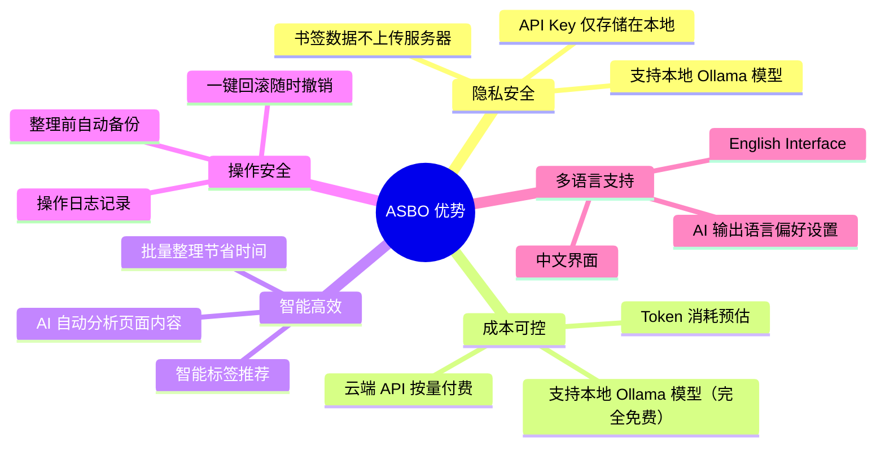
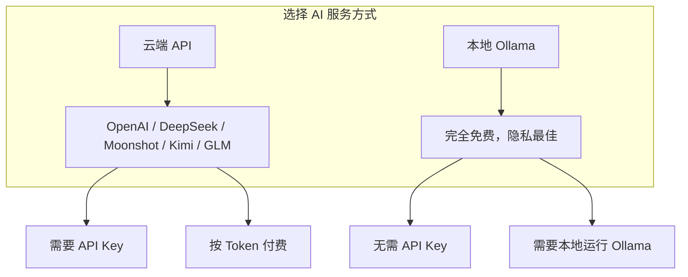
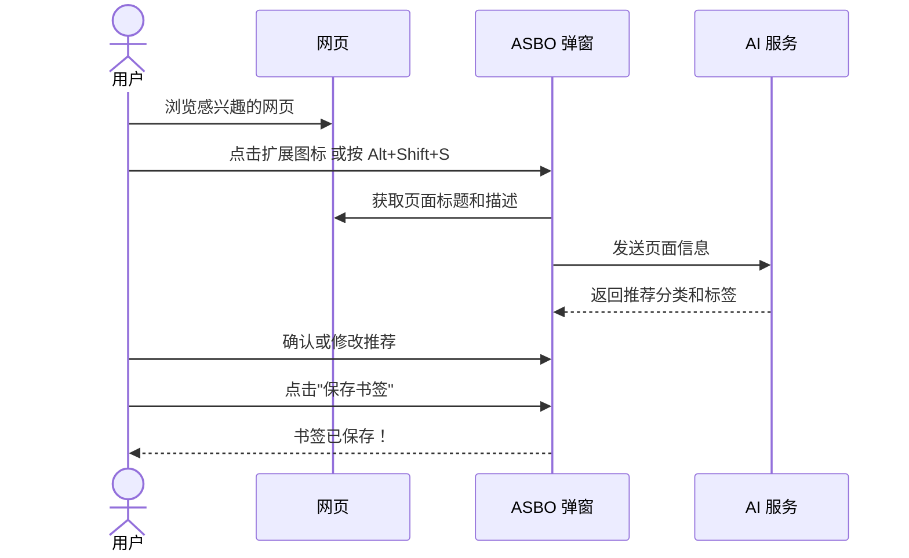
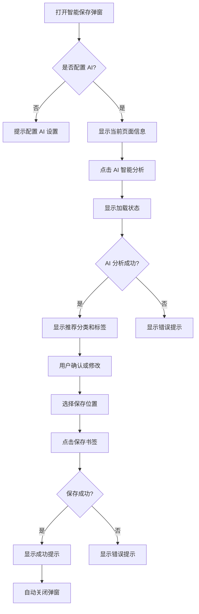
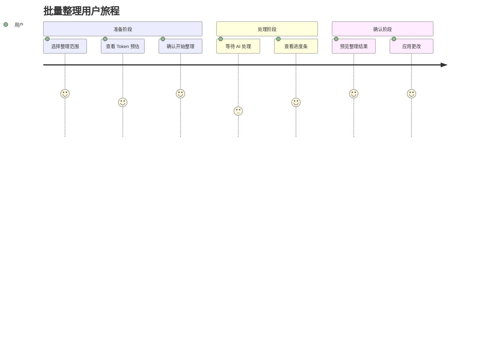
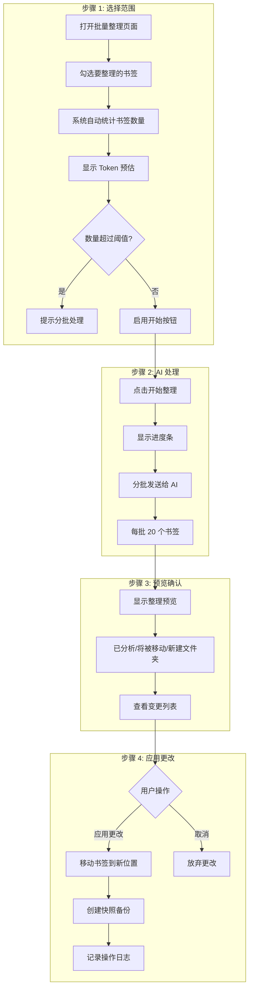
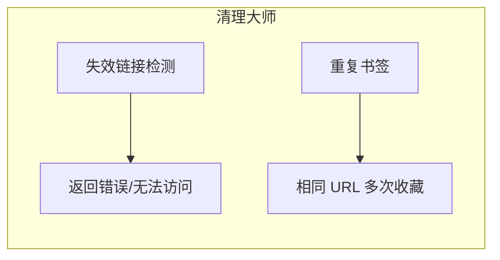
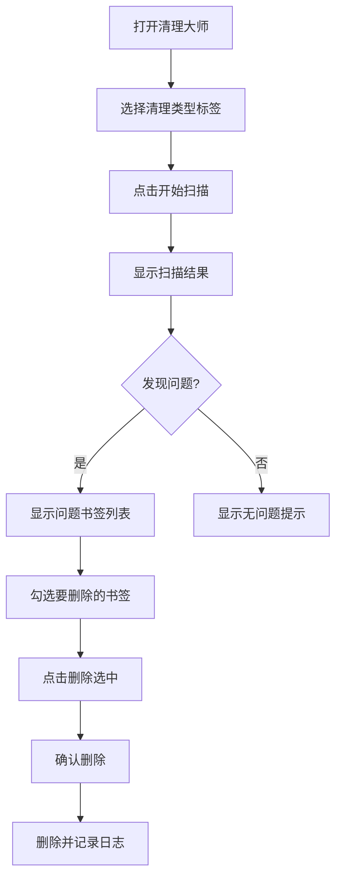
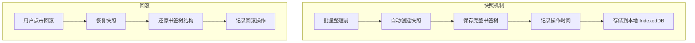

# AI Smart Bookmark Organizer - 用户操作手册

> 版本：v1.0.0 | 让收藏夹井井有条

---

## 目录

1. [产品简介](#1-产品简介)
2. [快速开始](#2-快速开始)
3. [功能模块详解](#3-功能模块详解)
4. [常见问题](#4-常见问题)

---

## 1. 产品简介

### 1.1 什么是 AI Smart Bookmark Organizer？

AI Smart Bookmark Organizer（简称 ASBO）是一款智能书签管理工具，通过 AI 语义理解技术，帮助您：

- **智能保存**：一键分析当前页面，自动推荐分类和标签
- **批量整理**：一键整理大量书签，告别混乱
- **清理大师**：自动检测失效链接、重复书签
- **历史回滚**：随时撤销整理操作，安全无忧
- **标签可视化**：以气泡图形式直观查看标签分布

### 1.2 核心优势



### 1.3 适用场景

| 场景       | 说明                                |
| ---------- | ----------------------------------- |
| 开发者     | 整理技术文档、GitHub 仓库、API 文档 |
| 研究人员   | 管理论文、参考资料、数据来源        |
| 重度用户   | 拥有数百上千书签，分类混乱          |
| 知识工作者 | 构建个人知识库，需要有序管理        |
| 多语言用户 | 需要中英文双语界面支持              |

---

## 2. 快速开始

### 2.1 安装扩展

```mermaid
flowchart LR
    A[打开 Chrome 扩展商店] --> B[搜索 "AI Smart Bookmark Organizer"]
    B --> C[点击"添加至 Chrome"]
    C --> D[确认权限请求]
    D --> E[安装完成]
```

**步骤：**

1. 打开 Chrome 浏览器
2. 访问 Chrome Web Store
3. 搜索 "AI Smart Bookmark Organizer"
4. 点击"添加至 Chrome"
5. 确认权限请求（书签、存储、当前标签页）

### 2.2 配置 AI 服务

首次使用需要配置 AI 服务，支持两种方式：



#### 方式一：云端 API（推荐新手）

1. 点击扩展图标 → 右键"选项"
2. 选择「云端 API」
3. 点击「快速选择模型」按钮选择提供商
4. 点击「测试连接」验证
5. 点击「保存设置」

#### 方式二：本地 Ollama（推荐隐私敏感用户）

1. **安装 Ollama**

   - 访问 [https://ollama.com](https://ollama.com) 下载安装
2. **下载模型**

   ```bash
   # 下载 gemma3:270m 模型（最轻量测试，建议根据本机性能选择其他更大参数模型）
   ollama pull gemma3:270m
   ```
3. **启动 Ollama 服务**

   ```bash
   # 设置环境变量允许扩展访问，若不成功见后文 Q&A（重要！）

   # Windows PowerShell
   $env:OLLAMA_HOST="0.0.0.0"
   $env:OLLAMA_ORIGINS="*"
   ollama serve

   # Windows CMD
   set OLLAMA_HOST=0.0.0.0
   set OLLAMA_ORIGINS=*
   ollama serve

   # Mac/Linux
   OLLAMA_HOST=0.0.0.0 OLLAMA_ORIGINS=* ollama serve
   ```
4. **在扩展中配置**

   - 打开扩展设置页面
   - 选择「本地 Ollama」
   - 输入 Ollama 地址（默认 `http://localhost:11434`）
   - 输入模型名称（通过在 cmd 中 执行 `ollama list` 查看已安装的模型）
   - 点击「测试连接」验证
   - 点击「保存设置」
5. **远程 Ollama 配置**（可选）

   - 如果在其他设备运行 Ollama，输入对应 IP 地址
   - 例如：`http://192.168.1.100:11434`
   - 确保远程 Ollama 已设置 `OLLAMA_HOST=0.0.0.0`

### 2.3 切换语言

扩展支持中英文双语界面：

1. 打开扩展设置页面
2. 在右上角找到语言切换按钮
3. 点击「中文」或「English」切换界面语言

**注意：** 切换语言后页面会自动刷新。

### 2.4 第一个智能保存



**操作步骤：**

1. 浏览到想收藏的网页
2. 点击工具栏的 ASBO 图标，或按快捷键 `Crtl+Shift+S` 呼出面板
3. 点击 AI 分析等待约 1-3 秒
4. 查看推荐的分类和标签
5. 如需修改，点击下拉框选择其他文件夹
6. 点击「保存书签」完成

**快速保存模式：**

- 按 `Alt+Shift+S` 一键分析保存
- 或在 `Crtl+Shift+S` 呼出面板后点击右上角「快速」开关

---

## 3. 功能模块详解

### 3.1 智能保存

替代浏览器原生的 `Ctrl+D`，提供更智能的收藏体验。

#### 功能入口

| 方式       | 操作             | 说明             |
| ---------- | ---------------- | ---------------- |
| 工具栏图标 | 点击扩展图标     | 打开完整编辑模式 |
| 快捷键     | `Alt+Shift+S`  | 打开快速保存模式 |
| 快捷键     | `Ctrl+Shift+S` | 打开完整编辑模式 |

#### 界面说明

```
┌─────────────────────────────────────┐
│  📑 智能保存              [快速] ⚙️ │
├─────────────────────────────────────┤
│                                     │
│  标题                               │
│  ┌─────────────────────────────┐   │
│  │ Kimi - K2 长思考上线         │   │
│  └─────────────────────────────┘   │
│                                     │
│  网址                               │
│  ┌─────────────────────────────┐   │
│  │ https://www.kimi.com/       │   │
│  └─────────────────────────────┘   │
│                                     │
│  [✨ AI 智能分析]                   │
│                                     │
│  ┌─────────────────────────────┐   │
│  │ ✨ AI 建议                  │   │
│  │ 分类: AI工具 (92% 置信度)     │   │
│  │ 理由: AI聊天工具              │   │
│  │ [创建文件夹 "AI工具"]         │   │
│  └─────────────────────────────┘   │
│                                    │
│  保存到                             │
│  ┌─────────────────────────────┐   │
│  │ ▼ AI工具                    │   │
│  └─────────────────────────────┘   │
│                                    │
│  标签                              │
│  ┌─────────────────────────────┐   │
│  │ 添加标签...          [添加]  │   │
│  └─────────────────────────────┘   │
│  [大模型] [国产] [聊天] [×]         │
│                                    │
│  ┌──────────┐  ┌──────────────┐    │
│  │  取消    │  │  保存书签     │    │
│  └──────────┘  └──────────────┘    │
│                                    │
└────────────────────────────────────┘
```

#### 操作流程



#### 标签管理

| 操作        | 说明                             |
| ----------- | -------------------------------- |
| 添加标签    | 输入标签名，按回车或点击「添加」 |
| 删除标签    | 点击标签右侧的 ×                |
| AI 推荐标签 | 点击「AI 智能分析」自动生成      |

---

### 3.2 批量整理

一键整理大量书签，告别收藏夹混乱。

#### 功能入口

1. 点击扩展图标 → 右键「选项」
2. 切换到「批量整理」标签页

#### 用户旅程



#### 操作流程



---

### 3.3 清理大师

自动检测问题书签，保持收藏夹健康。

#### 功能入口

设置页面 → 「清理大师」标签页

#### 清理类型



| 清理类型 | 说明                              | 操作       |
| -------- | --------------------------------- | ---------- |
| 失效链接 | 检测返回 404/500 或无法访问的链接 | 查看、删除 |
| 重复书签 | 基于 URL 匹配重复项               | 合并、删除 |

#### 操作流程



---

### 3.4 历史与回滚

随时撤销整理操作，安全无忧。

#### 功能入口

设置页面 → 「历史记录」标签页

#### 快照机制



#### 操作日志

| 字段     | 说明                           |
| -------- | ------------------------------ |
| 时间     | 操作执行时间                   |
| 类型     | 批量整理 / 清理大师 / 回滚操作 |
| 影响数量 | 被操作的书签数量               |
| 描述     | 操作详情                       |
| 快照     | 关联的快照 ID                  |

---

### 3.5 书签统计与标签可视化

#### 功能入口

设置页面 → 「书签统计」标签页

#### 统计信息

| 统计项     | 说明                      |
| ---------- | ------------------------- |
| 书签总数   | 所有书签的数量            |
| 文件夹数   | 用户创建的文件夹数量      |
| 最大深度   | 文件夹层级深度            |
| Token 预估 | 批处理时的 Token 消耗预估 |

#### 标签可视化

以气泡图形式展示标签分布：

- 气泡大小表示该标签下的书签数量
- 气泡颜色区分不同标签
- 点击气泡查看该标签下的所有书签

---

### 3.6 设置

#### AI 设置

| 设置项          | 说明                                           |
| --------------- | ---------------------------------------------- |
| AI 类型         | 云端 API / 本地 Ollama                         |
| 快速选择模型    | Kimi / DeepSeek / GLM / MiniMax / Gemini / GPT |
| Base URL        | API 基础地址                                   |
| API Key         | 您的 API 密钥（云端 API 需要）                 |
| Model Name      | 模型名称                                       |
| Ollama 服务地址 | 本地 Ollama 地址                               |
| Ollama 模型名称 | 已安装的模型名称                               |

#### AI 输出语言偏好

| 选项    | 说明                        |
| ------- | --------------------------- |
| 中文    | AI 返回的分类和标签使用中文 |
| English | AI 返回的分类和标签使用英文 |

#### 整理设置

| 设置项         | 说明                 | 默认值 |
| -------------- | -------------------- | ------ |
| 最大整理数量   | 超过此数量将提示分批 | 50     |
| Token 预警阈值 | 超过此值显示警告     | 10000  |

---

## 4. 常见问题

### Q1: Ollama 连接失败怎么办？

**A:** 需要在启动 Ollama 前设置环境变量：

```powershell
# Windows PowerShell
$env:OLLAMA_HOST="0.0.0.0"
$env:OLLAMA_ORIGINS="*"
ollama serve

# Windows CMD
set OLLAMA_HOST=0.0.0.0
set OLLAMA_ORIGINS=*
ollama serve

# Mac/Linux
OLLAMA_HOST=0.0.0.0 OLLAMA_ORIGINS=* ollama serve
```

注意：

1. 若变量设置命令执行不成功，则手动打开环境变量界面，添加 2 个系统环境变量
2. 在 Ollama Settings 中关闭允许外部通道
3. 单独在命令行中执行 `ollama serve`  命令
4. 确认 Ollama 是否已正确启动且所选模型存在（通过 `ollama list` 命令查看已安装模型）
5. 确认扩展中配置的 Ollama 地址是否正确，通过 `ipconfig` 命令查看 ipv4 地址，替换至 http://10.xxx.x.xx:11434

### Q2: 智能保存的快捷键是什么？

**A:**

- `Alt+Shift+S` - 打开快速保存模式
- `Ctrl+Shift+S` - 打开完整编辑模式

可以在 Chrome 扩展快捷键设置中修改。

### Q3: 批量整理会删除我的书签吗？

**A:** 不会。批量整理只会移动书签到推荐的文件夹，整理前会自动创建快照，随时可以回滚。

### Q4: 我的 API Key 安全吗？

**A:** 您的 API Key 仅存储在本地浏览器的加密存储中，不会上传到任何服务器。

### Q5: 支持哪些 AI 模型？

**A:**

- **云端**: Kimi、DeepSeek、GLM、MiniMax、Gemini、GPT
- **本地**: Ollama 支持的任何模型

### Q6: 整理后的书签可以恢复吗？

**A:** 可以。每次批量整理前都会自动创建快照，您可以在「历史记录」中点击「回滚」恢复。

### Q7: 为什么有些书签没有被整理？

**A:** 可能原因：

- 书签标题过于简单（如"Home"），AI 无法判断
- 超过了设置的「最大整理数量」限制
- 该书签已经在合适的文件夹中

### Q8: 如何切换界面语言？

**A:**

1. 打开扩展设置页面
2. 在右上角找到语言切换按钮
3. 点击「中文」或「English」
4. 页面会自动刷新并显示对应语言

### Q9: 标签是如何生成的？

**A:** 标签由 AI 根据页面内容自动生成。使用智能保存功能时，AI 会分析页面标题、描述和 URL，推荐相关的标签。标签数据存储在本地 IndexedDB 中。

### Q10: 清理大师检测失效链接准确吗？

**A:** 由于部分网站有反爬虫机制，失效检测可能不完全准确。建议：

- 对于重要书签，手动验证后再删除
- 检测结果仅供参考

---

## 附录

### 快捷键列表

| 快捷键           | 功能         |
| ---------------- | ------------ |
| `Alt+Shift+S`  | 快速保存模式 |
| `Ctrl+Shift+S` | 完整编辑模式 |

### 术语表

| 术语       | 说明                           |
| ---------- | ------------------------------ |
| Token      | AI 模型处理文本的基本单位      |
| 快照       | 书签树的完整备份               |
| 系统文件夹 | 默认的「书签栏」「其他书签」等 |
| Ollama     | 本地运行大语言模型的工具       |
| IndexedDB  | 浏览器本地数据库               |

---

*文档结束*
